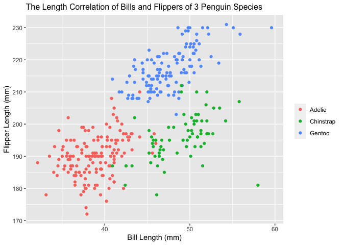

P8105 HW1 jl6046
================
Brian Jo Hsuan Lee
2021-09-25

Import package ‘tidyverse’.

``` r
library(tidyverse)
```

Create a data frame with 4 varibles and 10 observations.

``` r
set.seed(33)
rand_three = sample.int(n=3, size=10, replace=TRUE)

p1_df = tibble(
  rand_samp = rnorm(10),
  pos_samp = rand_samp > 0,
  len_ten_char = 'laundryday',
  len_ten_fac = factor(rand_three, labels=c("whites", "colors", "delicates"))
)

p1_df
```

    ## # A tibble: 10 × 4
    ##    rand_samp pos_samp len_ten_char len_ten_fac
    ##        <dbl> <lgl>    <chr>        <fct>      
    ##  1     1.01  TRUE     laundryday   colors     
    ##  2    -0.287 FALSE    laundryday   colors     
    ##  3     1.28  TRUE     laundryday   whites     
    ##  4    -1.72  FALSE    laundryday   colors     
    ##  5    -0.382 FALSE    laundryday   whites     
    ##  6     0.805 TRUE     laundryday   whites     
    ##  7    -0.367 FALSE    laundryday   whites     
    ##  8    -0.640 FALSE    laundryday   whites     
    ##  9     0.817 TRUE     laundryday   delicates  
    ## 10    -0.431 FALSE    laundryday   colors

Calculate the means of each of the 4 variables.

``` r
samp_mean = mean(pull(p1_df, rand_samp))
samp_mean
```

    ## [1] 0.008610144

``` r
pos_samp_mean = mean(pull(p1_df, pos_samp))
pos_samp_mean
```

    ## [1] 0.4

``` r
char_mean = mean(pull(p1_df, len_ten_char))
char_mean
```

    ## [1] NA

``` r
fac_mean = mean(pull(p1_df, len_ten_fac))
fac_mean
```

    ## [1] NA

Only numeric or logical values could be taken the means of. Therefore,
means of nominal values, such as characters and factors, are set to ‘Not
Available’.

We may understand this outcome by converting logical, character and
factors into numeric values:

``` r
p1_df %>% add_column(pos_samp_num = as.numeric(pull(p1_df, pos_samp))
                     , .after = "pos_samp")
p1_df %>% add_column(char_num = as.numeric(pull(p1_df, len_ten_char))
                     , .after = "len_ten_char")
p1_df %>% add_column(fac_num = as.numeric(pull(p1_df, len_ten_fac)))
```

When logicals are converted to doubles, ‘TRUE’s’ become 1s and ‘FALSE’s’
become 0s, and factors are converted into their assigned indices.
Characters, on the other hand, cannot be converted successfully.

Load ‘penguins’ data from “palmerpenguins”. Check the name and number of
variables as well as the number of observations.

``` r
data("penguins", package = "palmerpenguins")
p2_df_colnames = colnames(penguins)
p2_df_colnames
```

    ## [1] "species"           "island"            "bill_length_mm"   
    ## [4] "bill_depth_mm"     "flipper_length_mm" "body_mass_g"      
    ## [7] "sex"               "year"

``` r
p2_df_obs_size = nrow(penguins)
p2_df_obs_size
```

    ## [1] 344

``` r
p2_df_var_size = ncol(penguins)
p2_df_var_size
```

    ## [1] 8

‘penguins’ is a 344 by 8 table, and we’re interested in the average
length of penguin flippers documented.

``` r
flip_mean = mean(pull(penguins, flipper_length_mm), na.rm=TRUE)
flip_mean
```

    ## [1] 200.9152

The mean flipper length is 200.9 mm among the observed samples, ignoring
the missing values.

Show correlation between penguin bill lengths and flipper lengths using
a scatter plot.

``` r
scatterplot_df = tibble(
  flip_len = pull(penguins, flipper_length_mm),
  bill_len = pull(penguins, bill_length_mm),
  spec_color = pull(penguins, species)
)

ggplot(scatterplot_df, aes(x=bill_len, y=flip_len, color=spec_color)) + geom_point() + labs(title="The Length Correlation of Bills and Flippers of 3 Penguin Species") + ylab("Flipper Length (mm)") + xlab("Bill Length (mm)") + theme(legend.title = element_blank()) + theme(plot.title = element_text(size=12))
```

<!-- -->

## GitHub Documents

This is an R Markdown format used for publishing markdown documents to
GitHub. When you click the **Knit** button all R code chunks are run and
a markdown file (.md) suitable for publishing to GitHub is generated.

## Including Code

You can include R code in the document as follows:

``` r
summary(cars)
```

    ##      speed           dist       
    ##  Min.   : 4.0   Min.   :  2.00  
    ##  1st Qu.:12.0   1st Qu.: 26.00  
    ##  Median :15.0   Median : 36.00  
    ##  Mean   :15.4   Mean   : 42.98  
    ##  3rd Qu.:19.0   3rd Qu.: 56.00  
    ##  Max.   :25.0   Max.   :120.00

## Including Plots

You can also embed plots, for example:

<!-- -->

Note that the `echo = FALSE` parameter was added to the code chunk to
prevent printing of the R code that generated the plot.
